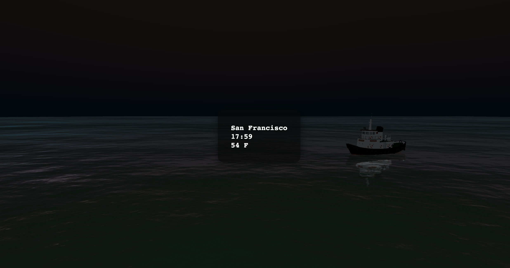

# weatherAPP



A simple web application for demonstrating the weather of a city with 3D models. Uses ThreeJS for 3D rendering.

[demo link](hhttps://weather3dapp.herokuapp.com/)

## Quick start

```bash
npm install
```

and

```bash
npm start
```
